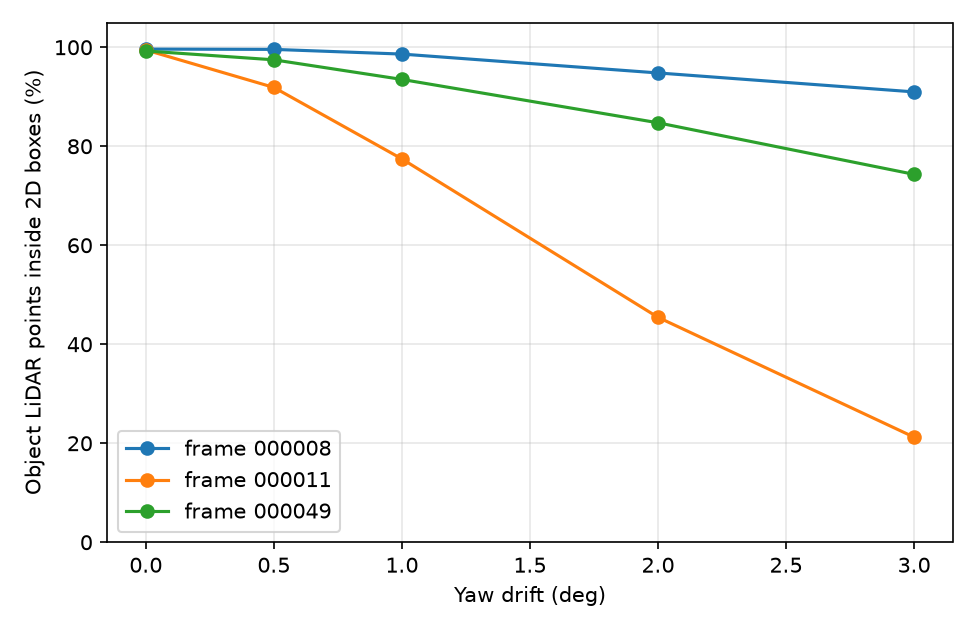
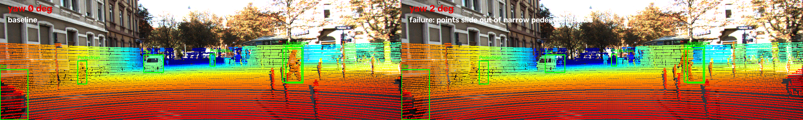

# Báo cáo Day 6: Độ nhạy projection với lệch yaw

- **Họ tên:** Nguyen Minh Duc
- **MSSV:** 2A202602783
- **Lớp:** AI20K-T4
- **Link repo:** https://github.com/minhduckx2004/NguyenMinhDuc-2A202602783-Track4-Day21
- **Topic:** A — LiDAR-camera projection QA
- **Dataset:** data/kitti_mini, data/synthetic, data/nuscenes_mini_subset
- **Các frame đã dùng:** 000000, 000008, 000011, 000049, scene-0103_010

## 1. Claim

Lệch yaw từ 2 độ trở lên làm tỉ lệ điểm LiDAR của vật thể rơi đúng vào 2D box giảm mạnh ở frame có nhiều người đi bộ: dưới 50% trên frame 000011, trong khi frame đông xe 000008 vẫn trên 90%. Metric chính là `hit_ratio = số điểm vật thể nằm trong 2D box / số điểm vật thể chiếu được vào ảnh`.

## 2. Evidence

Ảnh demo baseline: `results/figures/overlay_000011_r0.0_p0.0_y0.0_t0.0_0.0_0.0.png`.


Kết quả chính nằm trong `results/yaw_perturb_sweep.csv` và biểu đồ:



| Frame | Bối cảnh | hit_ratio yaw 0 độ | hit_ratio yaw 1 độ | hit_ratio yaw 2 độ | hit_ratio yaw 3 độ |
|---|---:|---:|---:|---:|---:|
| 000008 | đông xe | 99.63% | 98.62% | 94.81% | 90.98% |
| 000011 | nhiều người đi bộ | 99.45% | 77.44% | 45.44% | 21.23% |
| 000049 | nhiều vật bị che | 99.25% | 93.50% | 84.74% | 74.32% |

Ở yaw 2 độ, class `Pedestrian` chỉ còn 58.40% điểm nằm đúng box, thấp hơn `Car` là 91.34%. Số điểm nằm trong ảnh gần như không đủ để phát hiện lỗi: frame 000011 chỉ đổi từ 19946 ở yaw 0 độ lên 19963 ở yaw 2 độ, dù hit_ratio giảm từ 99.45% xuống 45.44%.

## 3. Failure case



- **Trường hợp:** KITTI frame 000011, chiếu LiDAR lên ảnh với calibration bị lệch yaw 2 độ.
- **Quan sát:** hit_ratio giảm từ 99.45% xuống 45.44%; nhiều điểm của người đi bộ trượt ra khỏi 2D box dù tổng số điểm trong ảnh gần như không đổi.
- **Nguyên nhân:** yaw 2 độ tạo lệch xấp xỉ `721.5 * tan(2 độ) = 25.2 px`, lớn hơn bề rộng ảnh của nhiều người đi bộ ở xa.
- **Lớp debug:** Geometry, cụ thể là extrinsic `Tr_velo_to_cam` sai.
- **Cách phát hiện khi chạy thật:** log hit_ratio trung bình theo class; nếu `Pedestrian` dưới 80% trong nhiều frame liên tiếp thì cảnh báo cần kiểm tra calibration.

## 4. Khuyến nghị nếu triển khai thật

Use-case phù hợp là xe giao hàng tự hành hoặc robot tuần tra trong khu đô thị tốc độ thấp, nơi camera và LiDAR cần khớp tốt để kiểm tra người đi bộ. Có thể chạy kiểm tra calibration khi xe dừng hoặc chạy chậm để giảm nhiễu do chuyển động và tiết kiệm CPU. Khi triển khai cần log `hit_ratio` theo class, số object đủ điểm LiDAR, nhiệt độ hoặc trạng thái gá cảm biến; ngưỡng cảnh báo đề xuất là `Pedestrian hit_ratio < 80%` trong 5 frame liên tiếp, vì trong thí nghiệm yaw 1 độ đã kéo frame 000011 xuống 77.44%.

## 5. Cách chạy lại

```bash
python -c "import numpy, cv2, matplotlib, pandas; print('OK')"
python tools/verify_data.py --data-root data/kitti_mini
python tools/verify_data.py --data-root data/nuscenes_mini_subset
python -m src.test_projection
python -m starter.data_health --data-root data/synthetic
python -m starter.data_health --data-root data/kitti_mini --out results/data_health_kitti.csv
python -m starter.data_health --data-root data/nuscenes_mini_subset --out results/data_health_nusc.csv
python -m starter.projection --data-root data/synthetic --frame 000000
python -m starter.projection --data-root data/kitti_mini --frame 000008
python -m starter.projection --data-root data/kitti_mini --frame 000011
python -m starter.projection --data-root data/kitti_mini --frame 000049
python -m starter.projection --data-root data/nuscenes_mini_subset --frame scene-0103_010
python -m src.exp_yaw_sweep --data-root data/kitti_mini --frames 000008 000011 000049
python -m src.plot_yaw_sweep
python -m src.make_failure_case
python tools/check_submission.py
```

## 6. Khai báo sử dụng AI

| Công cụ | Dùng cho việc gì | Bạn đã kiểm chứng thế nào |
|---|---|---|
| ChatGPT Codex | Hỗ trợ cài 2 hàm projection, viết script sweep yaw, plot, ảnh failure và hoàn thiện REPORT | Chạy `python -m src.test_projection`, kiểm tra số `inside_image`, chạy lại benchmark ra file giống hệt, và chạy `python tools/check_submission.py` |
| Codelab Day 6 | Dùng yêu cầu đề bài và script mẫu Topic A làm khung thí nghiệm | Đối chiếu bảng hit_ratio với kết quả kỳ vọng của codelab trước khi viết nhận xét |
